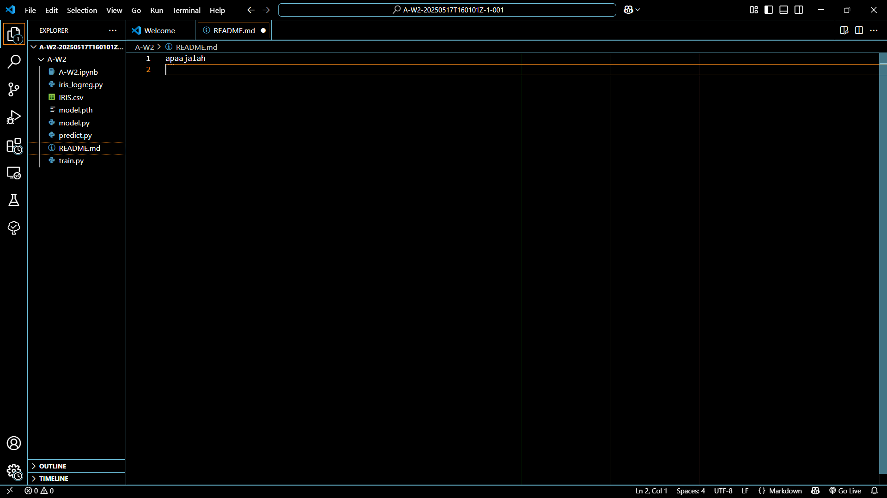

<pre> ```python num_epochs = 100 for epoch in range(num_epochs): optimizer.zero_grad() inputs = torch.randn(64, input_size) targets = torch.randn(64, output_size) outputs = model(inputs) loss = criterion(outputs, targets) loss.backward() optimizer.step() if (epoch+1) % 10 == 0: print(f'Epoch [{epoch+1}/{num_epochs}], Loss: {loss.item():.4f}') ``` </pre>
