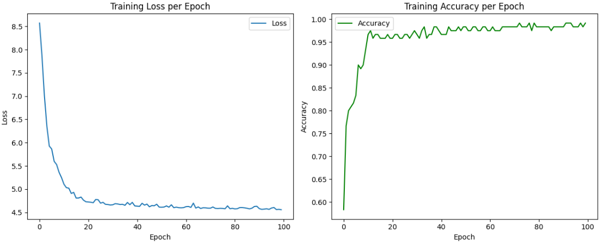

# Klasifikasi Bunga Iris menggunakan Multi-Layer Perceptron (MLP)

Proyek ini merupakan implementasi sederhana neural network (MLP) menggunakan PyTorch untuk melakukan klasifikasi bunga Iris. 
Dataset Iris merupakan dataset klasik yang terdiri dari tiga kelas bunga: *setosa*, *versicolor*, dan *virginica*, 
berdasarkan empat fitur morfologi bunga.

## Dataset

Dataset yang digunakan adalah **Iris dataset** dari `sklearn.datasets.load_iris()`, yang berisi 150 sampel dengan 4 fitur:
- Sepal length (cm)
- Sepal width (cm)
- Petal length (cm)
- Petal width (cm)

Target klasifikasinya adalah spesies bunga (3 kelas):
- *setosa*
- *versicolor*
- *virginica*

## Arsitektur Model

Model MLP yang digunakan terdiri dari:
- Input Layer: 4 neuron (jumlah fitur)
- Hidden Layer: 16 neuron + ReLU activation
- Output Layer: 3 neuron + Softmax (untuk klasifikasi multi-kelas)

# Building a Neural Network for Iris Classification with PyTorch

---

## 1. Import Library yang Diperlukan

Untuk memulai, impor modul PyTorch dan dataset Iris yang diperlukan:

```python
import torch
import torch.nn as nn
import torch.optim as optim
from sklearn.datasets import load_iris
from sklearn.model_selection import train_test_split
from sklearn.preprocessing import StandardScaler
```
## 2. Menyiapkan Dataset

Kemudian ambil dataset iris dari Sklearn dan lakukan preprocessing

```python
# Memuat dataset Iris dari scikit-learn
iris = load_iris()
X = iris.data  # Fitur (panjang/panjang kelopak & sepal)
y = iris.target  # Label (0=setosa, 1=versicolor, 2=virginica)

# Encode label (string ke angka)
encoder = LabelEncoder()
y_encoded = encoder.fit_transform(df['species'])

# Normalisasi fitur agar model lebih stabil saat training
scaler = StandardScaler()
X_scaled = scaler.fit_transform(X)

# Split data menjadi train dan test
X_train, X_test, y_train, y_test = train_test_split(X_scaled, y_encoded, test_size=0.2, random_state=42)

# Mengubah data ke tensor PyTorch
X_train_tensor = torch.tensor(X_train, dtype=torch.float32)
y_train_tensor = torch.tensor(y_train, dtype=torch.long)
X_test_tensor = torch.tensor(X_test, dtype=torch.float32)
y_test_tensor = torch.tensor(y_test, dtype=torch.long)

# Membuat dataset dan dataloader
train_dataset = TensorDataset(X_train_tensor, y_train_tensor)
train_loader = DataLoader(train_dataset, batch_size=16, shuffle=True)  # Mini-batch training
```
## 3. Mendefinisikan Model Neural Network MLP

Membuat arsitektur MLP dengan 1 Hidden Layer

```python
# Model MLP dengan 1 hidden layer
class MLP(nn.Module):
    def __init__(self):
        super(MLP, self).__init__()
        self.fc1 = nn.Linear(4, 16)       # Layer 1: input 4 fitur → 16 neuron
        self.relu = nn.ReLU()             # Fungsi aktivasi ReLU
        self.fc2 = nn.Linear(16, 3)       # Output: 3 neuron (kelas)
        self.softmax = nn.Softmax(dim=1)  # Softmax untuk klasifikasi multi-kelas

    def forward(self, x):
        x = self.relu(self.fc1(x))        # Forward ke hidden layer + aktivasi
        x = self.softmax(self.fc2(x))     # Output layer + softmax
        return x
```

## 4. Inisialisasi

```python
# Inisialisasi model, loss, dan optimizer
model = MLP()
criterion = nn.CrossEntropyLoss()  # Loss untuk klasifikasi multi-kelas
optimizer = optim.Adam(model.parameters(), lr=0.01)  # Optimizer Adam
```


nn.CrossEntropyLoss() di PyTorch digunakan untuk klasifikasi multi-kelas dan mengihitung perbedaan (kerugian/loss) antara output prediksi model dan label 
target yang sesuai.

## 5. Training Model

```python
losses = []       # Simpan loss tiap epoch
accuracies = []   # Simpan akurasi tiap epoch

# Loop training selama 100 epoch
for epoch in range(100):
    model.train()
    total_loss = 0
    correct = 0
    total = 0

    for xb, yb in train_loader:  # Mini-batch training
        optimizer.zero_grad()         # Reset gradien
        outputs = model(xb)           # Feedforward
        loss = criterion(outputs, yb) # Hitung loss
        loss.backward()              # Backpropagation
        optimizer.step()             # Update bobot

        total_loss += loss.item()
        _, predicted = torch.max(outputs.data, 1)
        correct += (predicted == yb).sum().item()
        total += yb.size(0)

    acc = correct / total
    losses.append(total_loss)
    accuracies.append(acc)

    if (epoch+1) % 10 == 0:
        print(f"Epoch [{epoch+1}/100] - Loss: {total_loss:.4f}, Accuracy: {acc:.4f}")
```

- Model ini memprediksi keluaran, menghitung kerugian, dan memperbarui bobot menggunakan backpropagation.
- Every 10 epochs, the loss is printed for monitoring.

## 6. Evaluasi Model

```python
model.eval()
with torch.no_grad():
    outputs = model(X_test_tensor)
    _, predicted = torch.max(outputs, 1)
    test_acc = (predicted == y_test_tensor).sum().item() / len(y_test_tensor)
    print(f"Test Accuracy MLP: {test_acc:.4f}")
```

Dari model evaluasi yang telah dilakukan, menunjukkan test akurasi MLP adalah 1.000

## 7. Visualisasi Loss dan Akurasi Selama Training Visualisasi selama training
```python
plt.figure(figsize=(12,5))

plt.subplot(1,2,1)
plt.plot(losses, label='Loss')
plt.title('Training Loss per Epoch')
plt.xlabel('Epoch')
plt.ylabel('Loss')
plt.legend()

plt.subplot(1,2,2)
plt.plot(accuracies, label='Accuracy', color='green')
plt.title('Training Accuracy per Epoch')
plt.xlabel('Epoch')
plt.ylabel('Accuracy')
plt.legend()

plt.tight_layout()
plt.show()
```
Berikut visualisasi selama proses training


## 8. Membandingkan Model MLP yang telah dilatih dengan Regresi Logistic

```python
# Logistic Regression
logreg = LogisticRegression(max_iter=200)
logreg.fit(X_train, y_train)

y_pred_logreg = logreg.predict(X_test)

ConfusionMatrixDisplay.from_predictions(y_test, y_pred_logreg, display_labels=iris.target_names)
plt.title("Confusion Matrix - Logistic Regression")
plt.show()

acc_logreg = accuracy_score(y_test, y_pred_logreg)
print(f"Accuracy Logistic Regression: {acc_logreg:.4f}")

# MLP
model = MLP()
model.load_state_dict(torch.load("model.pth"))  # Path ke model hasil training
model.eval()

X_test_tensor = torch.tensor(X_test, dtype=torch.float32)
with torch.no_grad():
    outputs = model(X_test_tensor)
    _, y_pred_mlp = torch.max(outputs, 1)
ConfusionMatrixDisplay.from_predictions(y_test, y_pred_mlp.numpy(), display_labels=iris.target_names)
plt.title("Confusion Matrix - MLP")
plt.show()

acc_mlp = accuracy_score(y_test, y_pred_mlp.numpy())
print(f"Accuracy MLP: {acc_mlp:.4f}")

# Visualisasi perbandingan akurasi
plt.bar(['Logistic Regression', 'MLP'], [acc_logreg, acc_mlp], color=['skyblue', 'orange'])
plt.ylabel('Accuracy')
plt.title('Comparison of Accuracy')
plt.ylim(0, 1)
plt.grid(axis='y')
plt.show()

print("\n Analisis:")
print(f"- Logistic Regression Accuracy: {acc_logreg:.4f}")
print(f"- MLP Accuracy: {acc_mlp:.4f}")

if acc_mlp > acc_logreg:
    print(" MLP lebih unggul: model mampu menangkap hubungan non-linear dalam data.")
elif acc_mlp < acc_logreg:
    print(" Logistic Regression lebih unggul: kemungkinan karena Iris dataset cukup linear.")
else:
    print(" Kedua model sama kuat: MLP tidak memberikan keunggulan berarti di dataset ini.")

print("\n Insight:")
print("- Logistic Regression lebih cepat, cocok untuk data sederhana.")
print("- MLP cocok untuk data kompleks, tapi butuh waktu lebih lama & tuning parameter.")

```

Dari hasil perbandingan antara model MLP dan Regresi Logistic untuk studi kasus pengklasifikasian bunga iris, dapat disimpulkan :
- Kedua Model sama kuatnya
- Logistic Regression lebih Cepat, cocok untuk data sederhana
- MLP cocok untuk data yang lebih kompleks, tapi membutuhkan waktu yang lama

